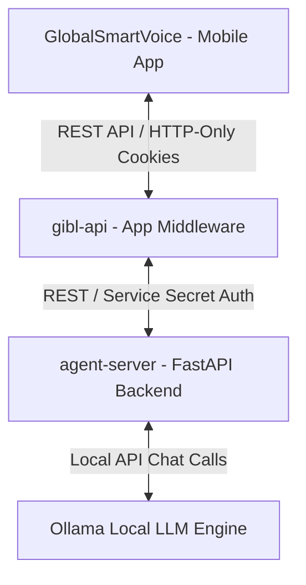
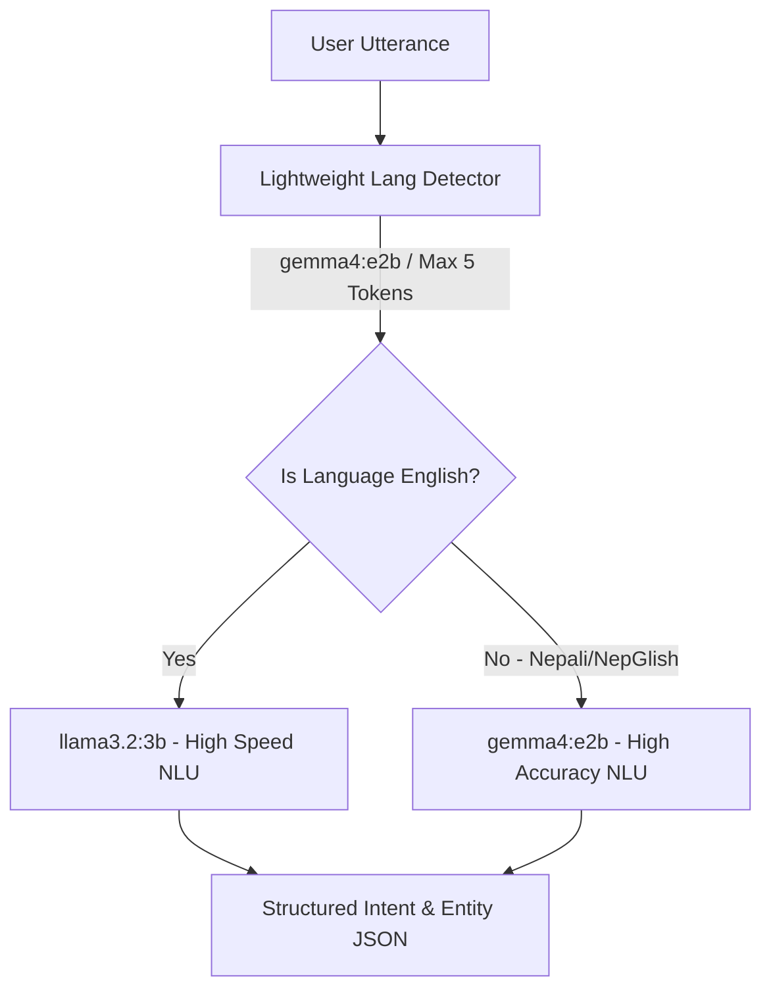

# Voice Banking Sahayak (व्वाइस बैंकिङ सहायक)

Voice Banking Sahayak is a state-of-the-art, multilingual voice assistant tailored for banking services in Nepal. It processes English, Nepali (Devanagari/Romanized), and NepGlish (code-switched language) utterances to seamlessly execute banking operations such as checking balances, viewing mini statements, blocking/unblocking cards, and performing fund transfers.

---

## 🏗️ Architecture Overview

The system is composed of three primary layers:



1. **GlobalSmartVoice (Mobile App)**:
   * React Native / Expo application.
   * Features high-performance on-device Text-to-Speech (TTS) via `expo-speech` to eliminate network & server synthesis latency.
   * Includes a settings overlay with a toggleable Vocal/Silent mode.
2. **gibl-api (App Middleware)**:
   * Node.js / TypeScript service managing user accounts, authentication, session tokens, and core banking functions.
3. **agent-server (FastAPI Backend)**:
   * LangGraph-based state machine that handles conversational flows, slot-filling, user confirmations, OTP verification, and API dispatches.
   * Uses Ollama to run local LLMs for NLU.

---

## ⚡ Dynamic NLU Routing Pipeline

To resolve latency issues during complex dialogues (especially for multi-intent inputs), the agent server employs a hybrid dynamic routing pipeline:



* **Step 1: Lightweight Language Detection**:
  The input text is classified using the base `gemma4:e2b` model. By setting `num_predict: 5`, it generates a single-word classification (`english`, `nepali`, `nepglish`) in under **0.3 seconds**.
* **Step 2: Model Routing**:
  * **English Queries**: Routed to the smaller, high-performance `llama3.2:3b` model for rapid processing.
  * **Nepali & NepGlish Queries**: Routed to the high-accuracy `gemma4:e2b` model to accurately process bilingual code-switching and local terms.

---

## 📊 NLU Model Benchmarks

Below are the benchmark results evaluated across all supported intents (10 examples per intent, covering English, Nepali, and NepGlish):

| Model | Accuracy | Precision | Recall | F1 Score | Avg. Latency (s) | Tokens/sec | JSON Success % |
| :--- | :---: | :---: | :---: | :---: | :---: | :---: | :---: |
| **gemma4:e2b** | **1.0000** | **1.0000** | **1.0000** | **1.0000** | 0.854s | 107.27 | 100.0% |
| **qwen2.5:latest** | 0.9636 | 0.9697 | 0.9636 | 0.9633 | 0.717s | 53.66 | 100.0% |
| **dolphin3:8b** | 0.9636 | 0.9697 | 0.9636 | 0.9633 | 0.704s | 50.86 | 100.0% |
| **llama3.1:8b** | 0.9636 | 0.9740 | 0.9636 | 0.9621 | 0.735s | 50.37 | 100.0% |
| **llama3.2:3b** | 0.9273 | 0.9364 | 0.9273 | 0.9267 | **0.473s** | 103.71 | 100.0% |
| **qwen3.5:4b** | 0.9273 | 0.9437 | 0.9273 | 0.9279 | 1.059s | 68.59 | 100.0% |

---

## 🛠️ Installation & Setup

### Prerequisites
* Python 3.11+
* Node.js v18+
* Ollama installed and running (`ollama serve`)

### 1. Local LLM Setup
Pull the required NLU models:
```bash
ollama pull gemma4:e2b
ollama pull llama3.2:3b
```

### 2. Configure Agent Backend
Navigate to `agent-server`, copy the `.env` file, and fill in the environment variables:
```bash
cd agent-server
pip install -r requirements.txt
```

Your `.env` should specify both the base model and the faster English fallback model:
```env
OLLAMA_HOST=http://localhost:11434
SAHAYAK_MODEL=gemma4:e2b
FASTER_MODEL=llama3.2:3b
DATA_LAYER_SERVICE_SECRET=your_data_layer_secret
```

Start the FastAPI server:
```bash
uvicorn server:app --host 0.0.0.0 --port 8000
```

### 3. Configure App Middleware
Navigate to `gibl-api`, install dependencies, configure its `.env` pointing to the agent server, and start the app:
```bash
cd gibl-api
npm install
npm run dev
```

### 4. Configure Mobile App
Navigate to `GlobalSmartVoice`, configure the target server API endpoints (using local LAN IP to minimize network latency), install dependencies, and start Expo:
```bash
cd GlobalSmartVoice
npm install
npx expo start
```
